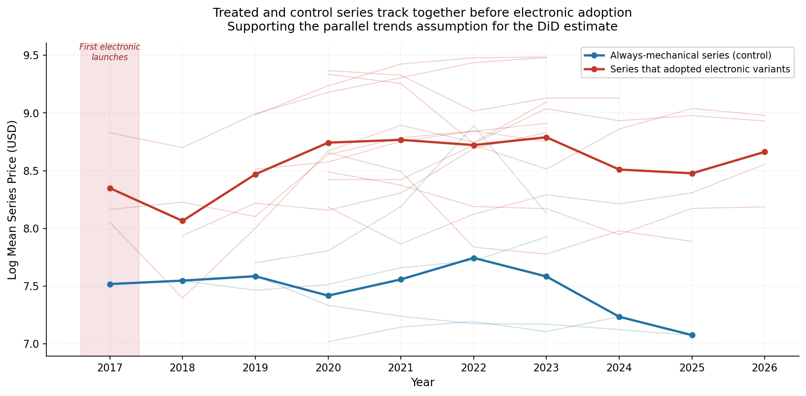

# Bike Pricing Intelligence

A data pipeline and econometric analysis of road and gravel bike pricing across Cannondale, Giant, and Trek, from live scraping through hedonic regression to a difference-in-differences causal test.

**Stack:** Python, requests, BeautifulSoup, Playwright, pandas, statsmodels, Wayback Machine CDX API

---

## Overview

Bike manufacturers publish MSRP with no systematic explanation of what drives price differences across models. This project scrapes current and historical MSRP data, normalizes component specs across brands, and runs two rounds of econometric modeling to answer two questions:

1. How much of a bike's price is explained by groupset, frame material, and platform positioning versus brand premium?
2. Does introducing electronic drivetrain variants causally raise a model series average price, or does it simply add a price point within an existing tier structure?

No public dataset captures cross-brand, multi-year MSRP alongside structured spec attributes, so the data pipeline was a prerequisite for the analysis.

---

## Data

Two scrapers collect road and gravel bikes from Giant and Cannondale using requests and BeautifulSoup for standard pages, with Playwright reserved for JavaScript-rendered product pages. Historical pricing for Cannondale and Trek was backfilled through the Wayback Machine CDX API, querying the Internet Archive for all product page snapshots and parsing the relevant HTML with no manual data entry.

| Dataset | Rows | Giant | Cannondale | Years |
|---|---|---|---|---|
| Full (V1) | 1,436 | 255 | 1,181 | 2017-2026 |
| Groupset-known (V2/V3) | 755 | 219 | 536 | 2017-2026 |
| Trek (DiD control) | 3,039 priced records | - | - | 2017-2026 |

Raw groupset strings were normalized into a `groupset_tier` categorical variable and a `groupset_rank` ordinal (0-10). Frame material was collapsed into `frame_tier` (carbon, carbon_hi_mod, aluminum). Model platform was extracted into a `model_series` variable (SuperSix EVO, Synapse, TCR Advanced, and others) via keyword lookup.

---

## Hedonic Pricing Regression

Three OLS models were estimated with HC3 heteroskedasticity-robust standard errors, using log(price) as the dependent variable.

| Model | n | R2 | Adj-R2 | Features |
|---|---|---|---|---|
| V1: Full sample | 1,436 | 0.429 | 0.426 | groupset_rank + unknown_flag + frame_tier + category + brand |
| V2: Complete-case baseline | 755 | 0.701 | 0.699 | Same, groupset-known only |
| V3: Enhanced | 755 | 0.832 | 0.824 | groupset_tier (categorical) + model_series + scrape_year |

Full model diagnostics, VIF checks, and coefficient tables are in [WRITEUP.md](WRITEUP.md).

---

## Causal Inference: Difference-in-Differences

The hedonic model explains price variation but cannot answer whether introducing electronic drivetrain variants causally shifts a model series average price. I used a two-way fixed effects (TWFE) DiD design to test this.

The first run produced a 95% confidence interval of -100% to +2,000,000%. The Cannondale Wayback backfill only extends to May 2020, and every Cannondale series that adopted electronic drivetrains did so in 2020. Zero pre-treatment years for every treated unit, one control series. There was no identifying variation in the data.

I added Trek as a second brand. Its product pages are archived from 2016 onward, and different Trek model lines adopted electronic drivetrains at different times between 2017 and 2022, providing the pre-treatment window and cross-series variation the design requires.

**Full TWFE result (n = 100 series-year observations, adj-R2 = 0.869):**

| Variable | Coef | p-value |
|---|---|---|
| treated_post (DiD estimate) | -0.019 | 0.923 |
| tariff_pct | -0.009 | 0.780 |
| aluminum_ppi | +0.012 | 0.458 |
| carbon_ppi | -0.015 | 0.174 |
| bikes_ppi | -0.030 | 0.201 |
| freight_ppi | +0.037 | 0.586 |

Pre-treatment event study coefficients (years -3 to -1): -0.50, -0.21, 0.00, all p > 0.16. The DiD estimate is -1.9% (95% CI: -33% to +44%), indistinguishable from zero.



---

## Predictive Validation

The V3 model was refit on an 80% training split and evaluated on a 20% holdout, stratified by brand.

| Metric | In-sample | Out-of-sample |
|---|---|---|
| R2 / Adj-R2 | 0.824 | 0.825 |
| RMSE (log points) | - | 0.341 |
| MAE (log points) | - | 0.264 |


---

## Caveats

- **Giant and Cannondale temporal asymmetry.** Cannondale provides a nine-year panel; Giant is close to a single-year cross-section. Brand-level coefficients should be read as directional, not precise.
- **MSRP, not transaction prices.** All prices are manufacturer list prices at time of scrape. Clearance events, dealer discounts, and regional pricing are not captured.
- **Small-n model series.** A few platforms (CAADX, Propel Advanced) have too few observations for precise coefficient estimates. Direction is informative; magnitude is not.

---

## Repository Structure

```
.
├── scrapers/          # Live scrapers per brand (Giant, Cannondale, Trek)
├── parsers/           # HTML parsing logic per brand
├── backfill/          # Wayback Machine CDX API backfill scripts
├── pipeline/          # Data cleaning, spec normalization, model-ready table builder
├── analysis/          # Regression scripts, DiD analysis, validation plots
├── data/              # Raw and cleaned CSV/parquet snapshots
└── WRITEUP.md         # Full methodology, diagnostics, and findings
```

---

## Tech Stack

| Layer | Tools |
|---|---|
| Scraping | Python, requests, BeautifulSoup, Playwright |
| Historical backfill | Wayback Machine CDX API, custom HTML parser |
| Data pipeline | pandas, parquet snapshots, modular pipeline |
| Regression | statsmodels OLS, HC3 robust standard errors, VIF diagnostics |
| Causal inference | Two-way fixed effects DiD, event study design |
| Output | CSV and parquet snapshots, regression outputs, written report |

For full methodology, diagnostics, and detailed findings, see [WRITEUP.md](WRITEUP.md).
